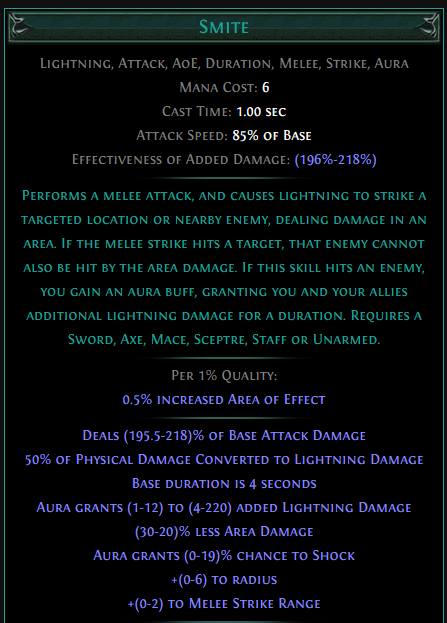

# Hollow Palm Technique 101 - Smite Raider {ignore}

*by Wojciech Olech AKA SteelPh0enix*

## Wstęp

Witaj w moim poradniku. Postaram się tutaj opisać swoją wersję postaci opartej o keystone Hollow Palm Technique wprowadzony w patchu 3.10, która jest stosunkowo tania do wystartowania, bardzo przyjemna w gameplayu oraz potrafi sobie poradzić z większością contentu.

Poradnik jest skonstruowany w taki sposób, żeby przedstawić cykl życia postaci, potrzebne przedmioty, mechaniki jakie wykorzystuję i jakie można wykorzystać z tym buildem oraz informacje pomocne w samodzielnym rozwoju postaci. Będę również umieszczał hiperłącza do podstron Wiki PoE na temat rzeczy które stosuję w tym buildzie.

Zachęcam do modyfikowania i poprawiania tego buildu, ponieważ na pewno nie jest on idealny i wierzę ze z odpowiednią ilością czasu i inwestycjami można z niego wyciągnąć znacznie więcej - zarówno pod względem ofensywnym jak i defensywnym.

Jeśli masz jakieś pytania: można znaleźć mnie na [Facebooku](https://www.facebook.com/steelph0en1x), [YouTube](https://www.youtube.com/channel/UCNbZooiWSOeu28mmOLCgQ2w), [grupie facebookowej Path of Exile Polska](https://www.facebook.com/groups/1542862185952229/) i na Discordzie (SteelPh0enix#6969)

Aktualna, najnowsza wersja guide'a będzie dostępna na moim Githubie pod tym linkiem: https://steelph0enix.github.io/PoEGuides/HollowBruhTechnique/hollowbruhtechnique.html

**PRZECZYTAJ CAŁY GUIDE ZANIM ZACZNIESZ ZADAWAĆ PYTANIA**

## Spis Treści {ignore}

[TOC]

## Materiały video

W tej chwili jest ich mało, ale jestem w trakcie przygotowywania video guide dla buildu w którym zamieszczę pełny showcase.

Jedna z poprzednich iteracji buildu, Twinned T8 Beach z -max res, Legion i Beyond: https://www.youtube.com/watch?v=hxFnjV3tSdY

## Path of Building

Aktualny Path of Building skonfigurowany pod single-target. ~5.1M DPS, ~3.2M Shaper DPS.
Pięć drzewek skilli - 3 do levelowania, jedno aktualne (lvl92) i jedno finalne (lvl100).
https://pastebin.com/Si0Fhyhk

**Bardzo gorąco polecam instalację Path of Building Community Fork!: https://github.com/PathOfBuildingCommunity/PathOfBuilding/wiki/Installing-this-Fork**

### Uwagi dotyczące PoB i obliczeń

* Elemental Exposure z Avatar of the Veil nie działa - dodałem trzy mody "Enemies Have #% To # Resistance" w hełmie żeby zasymulować ten efekt
* Domyślnie wybrane drzewko jest dla lvl92 - dostępne są cztery dodatkowe, dla lvl100 oraz trzy do levelowania
* Wszystkie wartości podane tutaj aplikują się do stanu mojej postaci na lvl92. Shaper DPS liczone są z aktywnymi efektami które może ona sustainować w walce przeciwko bossowi (frenzy charges, phasing, fortify, blood stance), normalne - z efektami jakie można wyciągnąć przy farmieniu (to co wcześniej + onslaught)
* Ekwipowanie The Dancing Dervish w PoB zalicza się jako aktywowanie Manifest Dancing Dervish, więc postać jest nadal traktowana jako unarmed + obliczenia pokazują stan przy aktywnym efekcie tego ostrza (bez Rampage, które trzeba ustawić osobno), co implikuje aktywację Onslaught. Żeby sprawdzić obrażenia bez Onslaught, trzeba zdjąć ostrze z ekwipunku w PoB.

## O buildzie

### Główne mechaniki

Ten build opiera się głównie na trzech rzeczach:

* Keystonie [Hollow Palm Technique](https://pathofexile.gamepedia.com/Hollow_Palm_Technique), który można zdobyć za pomocą jewela [One With Nothing](https://pathofexile.gamepedia.com/One_With_Nothing)
* Skillu [Smite](https://pathofexile.gamepedia.com/Smite), ponieważ jest jednym z moich ulubionych skilli melee w grze i ma specyficzny sposób działania
* Ascendacy [Raider](https://pathofexile.gamepedia.com/Raider) i [Frenzy Charges](https://pathofexile.gamepedia.com/Frenzy_charge), które pozwalają nam skalować naszą szybkość i damage.
* opcjonalne Rampage które możemy zdobyć dzięki [The Dancing Dervish](https://pathofexile.gamepedia.com/The_Dancing_Dervish) lub [The Dancing Duo](https://pathofexile.gamepedia.com/The_Dancing_Duo)

Oraz na kilku pomniejszych mechanikach które pozwalają nam uzyskać szybki i w miarę bezpieczny clear speed, nawet na wysokich tierach. Szczegóły niżej.

#### Mechaniki obronne

* Stackowanie Evasion i Armoura. In-combat w moim przypadku mam 38k evasion i ~9k armoura, co przekłada się na 70% evade chance i 43% physical damage reduction.
* Stackowanie HP oraz life leech - Vaal Pact pozwala mu działać znacznie szybciej, co ułatwia nam życie. **Sugeruję zrobić laby przed alokowaniem go, lub dealokować go na czas robienia ich - pułapki bardzo bolą przy braku regeneracji**. 
* Fortify - zmniejsza otrzymywane przez nas obrażenia o 20%, uptime powinien być permanentny jeśli mamy 5- lub 6-linka dla Smite
* Phasing - z permanentnym uptimem pozwala na przenikanie przez przeciwników, więc nie istnieje opcja że nas zablokują, a dodatkowo dzięki Avatar of the Veil mamy immunity to elemental aliments, więc nie musimy się martwić o flaska z anty-freezem.

### Plusy i minusy

+ Szybki clear speed

+ Dość tanio (~1-2ex) można wyciągnąć sensowny damage

+ Jedyny unique item jaki jest wymagany to One With Nothing

+ Najszybszy leveling jakiego doświadczyłem

+ Smite daje nam bezpieczny zasięg ataku

- Nie jest to uber boss killer na budżecie

- Nie daje rady facetankować bossów

- Ostateczna itemizacja bywa ciężka (problemy z resistami oraz int/str)

- Mamy mało socketów, więc musimy dobrze dobierać nasze gemy

### Zrobiony content na ten moment

* Mapki do T16 włącznie, bez "rippy" modów idą bez większych problemów, ale trzeba uważać na mechaniki bossów żeby się na nich nie wyłożyć. Testowane w paru przypadkach na double-beyond i monsters deal #% extra damage as #, dopóki się nie zagapimy to czyszczenie i delirium nie jest problemem.
* Guardian of the Phoenix
* Veritania T15, pozostali Conquerorzy stoją w kolejce do spawnu
* Simulacrum, zatrzymałem się na Wave 18 ze względu na Kosisa i jego pełnoekranową falę śmierci (:--))))

### Mody na mapach których chcemy unikać

* **Monsters reflect #% of Physical Damage** oraz **Monsters reflect #% of Elemental Damage** to dla nas automatyczny zgon - Smite konwertuje 50% fizycznych obrażeń na lightning, a Hatred daje % physical damage jako extra cold damage, więc oba mody nas zabijają.
* **Players cannot Regenerate Life, Mana or Energy Shield** boli, ale jest do przeżycia
* **Monsters deal #% extra Physical Damage as #** potrafi mocno zaboleć kiedy boss nam przyłoży, ale dopóki jesteśmy w stanie unikać jego mechanik lub jesteśmy wystarczająco tanky, to ten mod nie powinien sprawiać problemów

### Opis mechanik buildu

#### Hollow Palm Technique

HPT to bardzo ciekawy keystone który ma znacznie większy potencjał niż [Facebreakery](https://pathofexile.gamepedia.com/Facebreaker). W zamyśle, ten keystone ogranicza naszą postać w zakresie ekwipunku, dając wzamian dość nieetyczną ilość obrażeń.

W tłumaczeniu, dopóki jesteśmy [Unencumbeder](https://pathofexile.gamepedia.com/Unencumbered), to nasze ataki liczą się jako dual wielding, mamy 60% **więcej** szybkości ataku oraz 14-20 dodatkowego physical damage per 10 dexa.
Dla porównania, troszkę matematyki: topowe 2-ręczne bronie są w stanie dać 700+ pDPS (physical damage per second). 1-ręczne bronie mogą nam dać 400 pDPS, w połączeniu z bonusami od dual wielding to około 520 pDPS per broń.
DPS jest liczony następującym wzorem: $\text{minDMG} + (\frac{\text{maxDMG} - \text{minDMG}}{2}) \cdot \text{attack speed}$. 
Bazowy unarmed attack speed to około 1.2APS (attacks per second).
Bardzo łatwo nam w tym buildzie wyciągnąć dexterity w granicach 500 bez żadnej inwestycji, co daje nam 7000-10000 flat physical damage, czyli średnio 8500 pDMG z Hollow Palma. Nie wliczając jeszcze bonusu od dual wielding.
Dodając do tego zyskany attack speed, to nasz attack speed z samym hollow palmem oraz dual wielding (10% more od dual wielding + 60% more z HPT = 70% more attack speed) to $1.2 \cdot 1.7 = 2.04$ APS

Dorzucając do pDPS bonus z DW (20% more attack physical damage), mamy finalnie $10200 \cdot 2.04 = 20808$ pDPS - bazowo, bez żadnych dodatkowych bonusów ani zwiększeń. Z samym HPT i 500 dexterity. Znacznie więcej niż bazowe pDPS które możemy dostać z najlepszej broni w grze jaką można stworzyć na ten moment.

Oczywiście nie oznacza to że zwykłe bronie są useless i buildy z nimi są kompletnie bez sensu, biorac pod uwagę istnienie tej pasywki - same bazowe obrażenia to nie wszystko, skalowanie robi nam sporo roboty, a dzięki modom na broniach można uzyskać bardzo fajne efekty i potencjalnie więcej DPS, z odpowiednio dużą ilością currency jaką włożymy w bronie. Nie wspominając o mechanikach i skillach których nie możemy zastosować będąc unencumbered. Mimo wszystko, taka ilość bazowych obrażeń daje nam duże pole do popisu w zakresie skalowania go, oraz pozwala skupić się na innych aspektach naszej postaci.

#### Smite

[Smite](https://pathofexile.gamepedia.com/Smite) to bardzo ciekawy, dość niszowy skill *pseudo-melee*.

Jest to strike skill z małym AoE którym możemy atakować na bardzo dużą (jak na melee) odległość, który daje nam aurę zwiększającą obrażenia i szansę na shock. Bardzo przyjemnie się skaluje z added damage i konwertuje połowę obrażeń na lightning.

Zasięg tego skilla jest główną rzeczą za którą go lubię. Pozwala z bezpiecznej odległości atakować przeciwnika, co również umożliwia bardziej skuteczną reakcję na ataki i przyspiesza clear speed, szczególnie w połączeniu z Ancestral Call.

W tym buildzie nie będziemy przejmować się AoE (nawet w Blood Stance z Concentrated Effect jest on wystarczająco duży do szybkiego cleara), będziemy skalować tylko jego damage.

#### Raider + Frenzy Charges

[Frenzy Charges](https://pathofexile.gamepedia.com/Frenzy_charge) to jeden z trzech rodzajów charge'ów dostępnych w grze. Każdy frenzy charge domyślnie daje nam
* 4% increased attack speed
* 4% increased cast speed
* 4% **more** damage

Domyślnie możemy mieć max 3, ale w buildzie z samego drzewka jesteśmy w stanie zwiększyć ten limit do 7, co sumarycznie daje nam zwiększony o 21% attack speed, oraz o 21% więcej obrażeń (cast speed nas nie interesuje bo nie używamy zaklęć). **more** damage jest tutaj bardzo przyjemnym dodatkiem, bo mnoży to nasze obrażenia razy 100+#%, zamiast zwiększać je (co jest addytywne z innymi modyfikatorami "increased damage" i działa trochę słabiej) - więcej na ten temat można przeczytać [tutaj](https://pathofexile.gamepedia.com/Stat#more_vs_increased)

Na dodatek, pasywki Discipline of the Slaughter (drzewko) i Avatar of the Slaughter (ascendacy Raidera) i node'y prowadzące do nich pozwalają nam wyskalować frenzy charges jeszcze mocniej, dzięki czemu każdy frenzy charge daje nam 

* 5+4+8% = 17% increased evasion rating
* 3+2 = 5% increased movement speed
* 4+2+3 = 9% increased attack speed
* 5+8 = 13% increased attack damage (5% inc damage i 8% inc attack damage)
* 4% more damage
* 4% increased cast speed

Razy siedem, te statystyki to prawie połowa naszych obrażeń. Sustain jest bezproblemowy dzięki 25% szansy na zyskanie frenzy charge przy zabójstwie, oraz 20% szansy na zyskanie frenzy charge przy trafieniu unique/rare enemy w przypadku bossów - dzięki ascendacy Way of the Poacher i notable Discipline of the Slaughter.

#### Rampage

To jest opcjonalny element buildu, ponieważ trzeba przyzwyczaić się do jego triggerowania, co bywa lekko uciążliwe.

Istnieje taki item jak [The Dancing Dervish](https://pathofexile.gamepedia.com/The_Dancing_Dervish), oraz jego ulepszona, różniąca się jednym szczegółem, wersja - [The Dancing Duo](https://pathofexile.gamepedia.com/The_Dancing_Duo).

Tak, jest to miecz. Technicznie, nie możemy używać żadnych mieczy jeśli chcemy mieć bonus z Hollow Palm Technique, jednak ten konkretny miecz ma pewną specyficzną mechanikę powiązaną z nim.

W momencie w którym zabijemy kilku przeciwników za jego pomocą (aczkolwiek są pewne "tricki" które pozwalają to uprościć), dzieje się kilka rzeczy. Po pierwsze - włącza się Rampage. Po drugie, zostają wyłączone oba sloty na broń. I po trzecie, uduchamia nam się efekt *"Manifest Dancing Dervish"*.

*Manifest Dancing Dervish* to efekt który tworzy miniona, który pomaga nam atakując przeciwników z użyciem Cyclone o małym zasięgu. Nie zadaje on znaczących obrażeń, więc nie będziemy zajmować się jego ulepszaniem (technicznie - gemy umieszczone w mieczu będą supportować tego miniona). Na dodatek, efekt ten daje nam Onslaught - który i tak dostajemy z drzewka (i którego nie do końca warto się pozbywać - czytaj dalej).

Wyłączenie obu slotów na broń pozwala nam wykorzystywać Hollow Palm Technique bez problemów. Jako ciekawostkę, dodam że **mimo tego że weapon sloty są wyłączone, to gemy nadal się levelują a inkubatory zyskują progress**.

Rampage to efekt który nas najbardziej interesuje. W momencie go uzyskania, po lewej stronie ekranu pojawia się licznik zabójstw (maksymalna ilość jaką potrafi doliczyć to 1000). Co 20 zabójstw, dostajemy

* 1% increased movement speed
* 2% increased damage

Więc, im więcej zabójstw, tym szybciej możemy zabijać - przy 1000 stacków mamy 50% wincreased movement speed i 100% increased damage. Przekłada się to na zwiększenie naszych DPS z ~4.6M do ~5.3M (notka: increased =/= more, dlatego tylko do 5.3M a nie 9.2M. I podaję tutaj normalne DPS, a nie shaper DPS).

##### Jak łatwiej triggerować Rampage?

Istnieje pewien trick który pozwala przyspieszyć ten proces. Mianowicie - wystarczy że zabijemy tylko jednego przeciwnika za pomocą tego miecza, a potem swapniemy bronie na drugi set. Jeden kill "striggeruje" nam efekt, ale nie da rampage - do tego musimy zabić kilku(nastu) przeciwników, jest to jednak znacznie łatwiejsze będąc unencumbered niż używając tego miecza.

Zabójstwa członków grupy, totemów i minionów również się liczą - można do tego użyć Ancestral Warchiefa

Problem pojawia się natomiast przy swapowaniu na drugi set - nie możemy normalnie swapować, jeśli nie mamy niczego w drugim secie. Technicznie nie możemy tam też niczego co możemy mieć ekwipowane trzymać, bo wtedy całą naszą taktykę szlag trafia i HPT nie działa.

Rozwiązanie: **włożenie tam broni które będą miały zbyt wysokie requirements dla nas**. Wtedy, mimo tego że będą w slocie, nie będą zaliczane jako "założone" i HPT będzie działać, a na dodatek będziemy mogli swapować bronie bez problemu i levelować w nich gemy.

Żeby móc założyć takie bronie (polecam tutaj wandy, bo zazwyczaj będą wymagały więcej inta niż będziemy mieli na postaci), craftujemy sobie amulet z dużą ilością statystyki która nas blokuje, opcjonalnie możemy też respecować drzewko (prawie po drodze mamy notable który daje 30 inta), zakładamy wandy i cofamy zmiany.

### TL;DR How to play

* Wchodzisz na mapkę
* Odpalasz buffy
* Zabijasz co najmniej jednego przeciwnika za pomocą The Dancing Dervish/Duo
* Swapujesz bronie
* Przelatujesz przez mapkę na pełnych buffach
* Powtarzasz

## Leveling

Do PoBa dołączyłem trzy drzewka związane z levelowaniem buildu. Sugeruję nimi podążać.

Jeśli możemy, najlepiej kupić lvl1 20% quality Smite od kogoś, możemy go używać od początku gry. 

W przypadku kiedy nie jesteśmy w stanie załatwić sobie Smite w ten sposób, polecam stworzyć nową postać - Templara, zabić za jego pomocą Hillocka i wziąć Smite jako nagrodę za misję, a następnie przenieść za pomocą stasha na główną postać.

Pomagamy Nessie, wypełniając poboczną misję "Mercy Mission" - ta ze zdobyciem Medicine Chest na The Tidal Island, co pozwoli nam zdobyć Ancestral Call Support (nie dostaniemy go jako quest reward, trzeba go kupić), który znacząco przyspieszy nasz leveling.

Od razu po alokowaniu skrajnego jewel socketa, wsadzamy tam One With Nothing i alokujemy Hollow Palm Technique, pozbywając się broni i rękawiczek.

Supportujemy Smite gemami które dają physical/elemental damage i attack speed, zgodnie z linkami (Ancestral Call to priorytet który zawsze powinien być podczas levelowania zlinkowany) 

Levelowanie z HPT jest bardzo szybkie i przyjemne, jeśli brakuje nam leveli pod koniec aktu 10 - polecam przejść się do Delve.

## Drzewko skilli

W drzewku kluczowymi elementami są
* Dolny prawy skrajny jewel socket (obok Point Blank) - musimy gdzieś wsadzić nasz kluczowy jewel One With Nothing
* Frenzy charges - ze względu na to że je skalujemy, chcemy zebrać wszystkie node'y +1. Dodatkowo, warto chwycić Blood Drinkera, jewel socket i Cloth and Chain obok tych node'ów ze wzgledu na przydatne defensywne bonusy (hp/leech/res/evasion/jewel socket).
* Utmost Swiftness - daje zwiększone o 8% dexterity + 70 flat dex po drodze, dając mi około 15% DPS na ten moment
* Disciple of the Slaughter i node'y prowadzące do niego - opisałem wyżej, skalowanie frenzy charges

Po drodze łapiemy tyle node'ów HP ile jesteśmy w stanie. Bonusowo, zdecydowałem się na pójście po pasywki Ambidexterity (obok skrajnego jewel socketa, zwiększa damage przy double wield) i Graceful Assault (zbuffowany Onslaught = więcej dmg + movement speed).

Mocno sugeruję zbierać również wszystkie okoliczne jewel sockety - w nich będziemy uzupełniać nasze resisty.

Vaal Pact jest opcjonalny - jeszcze testuję jego działanie, ale na papierze wygląda bardzo przyjemnie, nawet mimo tego że mamy sporo regeneracji życia w drzewku i ekwipunku która nam przez Vaal Pact znika.

Pod Vaal Pactem należy zaalokować punkcik pod mana leech, jeśli mamy problemy z sustainem many.

## Ascendacy

Alokujemy w podanej kolejności:

1. Way of the Poacher - frenzy charges pozwolą nam szybciej levelować
2. Avatar of the Slaughter - w międzyczasie będziemy zbierać na drzewku node'y zwiększające ilość frenzy charges, więc skalowanie nam jeszcze bardziej przyspieszy grę
3. Quartz Infusion - permanentny Phasing i zwiększone obrażenia
4. Avatar of the Veil - zwiększona szybkość, elemental exposure (przeciwnicy otrzymuje 15% więcej obrażeń typu fire/cold/lightning) i movement speed

## Skill gem setup

Mamy dostępne trzy setupy - 6-link i 2 4-linki, więc trzeba je dobrze wykorzystać.

### Smite - główny 6-link

<b>Smite - Ancestral Call/Ruthless - Multistrike - Melee Physical Damage - Concentrated Effect - Fortify</b>

Kolejność linkowania oczywiście nie ma tu znaczenia. Ancestral Call zamieniamy na wiekszych bossach na Ruthless, dla dodatkowych ~30% DPS.

Jeśli nie mamy jeszcze 6-linka, dla 4-linka polecam setup Smite - Ancestral Call/Ruthless - Multistrike - Melee Physical Damage. Jako 5 link sugeruję Fortify jeśli chcemy troszkę więcej defensywy, lub Concentrated Effect jeśli chcemy więcej DPS.

### Aury

<b>Enlighten - Blood and Sand - Herald of Ash - Hatred</b>

Blood and Sand daje nam sporego boosta do DPS lub AoE za marne 10% zarezerwowanej many.
Herald of Ash daje 15% physical damage jako dodatkowy fire damage, a na dodatek zwiększa ten fire damage. Bonusowo daje on overkill damage wokół zabijanych przeciwników, który zwiększa clear speed.
Hatred daje nam 25% physical damage jako dodatkowy cold damage i zwiększa cold damage o 18% (na lvl20).

*#% physical damage gained as # damage* to kluczowy rodzaj moda dla nas, ponieważ biorąc pod uwagę ilość flat pDPS jaką mamy, to te mody najbardziej zwiększają nasz output damage.

Enlighted nie jest wymagane jeśli jesteśmy w stanie sustainować manę. Jest jednak bardzo pomocne w tej kwestii i ciężko utrzymać nam te trzy aury włączone bez niego nawet na lvl2.

Jeśli nie mamy Enlighted i mamy problemy z maną - sugeruję zrezygnować z Blood and Sand, trzymać tylko do levelowania. Opcjonalnie, można annointować pasywkę z *reduced mana reservation* na drzewku.

### Movement i utility

<b>Dash - Second Wind

Vaal Ancestral Warchief

Blood Rage</b>

Dash z Second Wind to nasz główny skill do poruszania się. 
Ancestral Warchief znacząco zwiększa nasze obrażenia, wersja Vaal jeszcze mocniej (zwykły Warchief o 18%, Vaal o 32%), a dodatkowo pomaga procować Rampage (bo jego kille również się liczą) i pomaga przy bossach.

Blood Rage może zostać zamieniony na Enduring Cry (regeneracja HP i generowanie endurance charges) lub Rallying Cry (więcej damage), jeśli weźmiemy pasywkę na drzewku "Battle Cry" i przypiszemy go do lewego przycisku mysz, co pozwoli nam go procować podczas chodzenia postacią.

W aktualnej mecie są również bardzo potężne medium cluster jewele pod Warcry, których jeszcze nie testowałem, ale podejrzewam że efekt może być **znacznie** lepszy niż Blood Rage, dlatego gorąco zalecam eksperymentowanie.

### Opcjonalnie - jeśli mamy unset ringi

Jeśli mamy unset ringi, to nie musimy zamieniać Blood Rage na Warcry, można Warcry wrzucić w ring. Opcjonalnie dwa różne do dwóch ringów, żeby używać ich sytuacyjnie.

## Gearing

### Bronie

Wyjaśniłem to wyżej, ale powtórzę.

Generalnie - nie potrzebujemy żadnych. Jeśli chcemy czyścić mapy szybciej, to możemy użyć [The Dancing Dervish](https://pathofexile.gamepedia.com/The_Dancing_Dervish) lub [The Dancing Duo](https://pathofexile.gamepedia.com/The_Dancing_Duo). Są na prawdę bardzo tanimi broniami (swojego Dervisha kupiłem za 1alch), więc nie widzę powodu żeby ich nie używać, poza upierdliwością triggerowania mechaniki.

Wtedy, w off-handzie potrzebujemy broni z zbyt wysokimi requirements dla naszej postaci. Szczegółowe instrukcje znajdziesz [wyżej](#rampage).

### Zbroja

Na start - [Tabula Rasa](https://pathofexile.gamepedia.com/Tabula_Rasa) to oczywisty wybór

Po tabuli, najsensowniejszy wybór to rare Evasion/Armour-based 6-link

Sensowny 6-link powinien mieć co najmniej ~100 flat HP i albo możemy za jego pomocą wypełnić brakujące resisty oraz statystyki, albo możemy pójść krok dalej i poszukać/craftować na nim kilka ofensywnych modów.

Defensywne mody:
* HP (flat/%)
* Resisty
* Evasion/armour
* Additional physical damage reduction
* Nearby enemies are blinded (Redeemer prefix)
* Reduced # damage taken (Delve)

Ofensywne mody:
* flat dexterity
* #% increased dexterity (Redeemer/Elder suffix)
* +1 to Level of # Gems (Elder/Redeemer prefix - Support Gems, Warlord prefix - Active Skill Gems, Delve suffix - Strength Gems)
* Enemies you Kill Explode, dealing #% of their Life as Physical Damage (Crusader prefix)

Szczerze mówiąc, nie znalazłem żadnych wartych uwagi unique alternatyw które były by lepsze od rare zbrojki. Są trzy typowe propozycje: Loreweave, Belly of the Beast i Wildwrap.

* Wildwrap - daje nam ogromną ilość DPS, ale niestety kolorowanie go pod nasz setup jest bardzo kosztowne, [Vorici Calculator](https://siveran.github.io/calc.html) podpowiada mi że trzeba wydać średnio 15k chromaticów żeby trafić w kombinację 5r1b
* Belly of the Beast - jesteśmy w stanie łatwo kupić/wycraftować sobie 6-linka który da nam więcej HP z prostego powodu - nie brakuje nam % increased HP, brakuje nam flat HP.
* Loreweave - bardzo średnia zbrojka w naszym przypadku, ujdzie i łatwo ją pokolorować, ale ma sens tylko jeśli jesteśmy w stanie zdobyć 6-linka tanio. Dobrze wyrollowany Loreweave będzie na równi z bonusem damage jaki nam da flat dex na rare zbroi, ale będzie mieć znacznie mniej HP.

### Hełm

* [Devoto's Devotion](https://pathofexile.gamepedia.com/Devoto%27s_Devotion) - prawdopodobnie najlepsza opcja dps-wise. Bardzo ładnie wpasowuje się w build i w tej lidze jest bardzo tani (5c+)

* [Starkonja's Head](https://pathofexile.gamepedia.com/Starkonja%27s_Head) - trochę bardziej defensywny, ale również bardzo tani unique helmet. 

* Rare evasion/armour helmet - Jeśli potrzebujemy więcej defensyw i miejsca na rezystancje, kosztem DPS.

### Buty

* [Garukhan's Flight](https://pathofexile.gamepedia.com/Garukhan%27s_Flight) - te buty są nam w stanie dać łącznie ~600HP (po zwiększeniach) dzięki pasywce która daje 2HP per 10dex. Dodatkowo mają ogromną ilość evasion rating, 30% movement speeda i flat dexterity. Jeśli nie mamy alokowanego vaal pactu, to regen również jest przyjemnym dodatkiem do defensywy. Wadą jest to, że nie są tanie - 2.5ex+ w momencie pisania guide'a.

Zanim nas będzie na nie stać, to polecam kupić jakieś butki z dużą ilością HP i dexterity, oraz opcjonalnie tymczasowymi resistami które potem zapełnimy w reszcie ekwipunku, przed kupnem Garukhanów.

### Amulet

* Rare amulet. Najlepiej Jade. Mody które nas najbardziej w nim interesują to
    * flat dexterity (optymalnie łącznie 100+ z catalystami)
    * #% increased dexterity (redeemer mod)
    * HP
    * Gain #% of Physical Damage as Extra # Damage (ogromny boost do obrażeń)
    * 1% Increased Damage per 15 Dexterity (trochę mniejszy boost do obrażeń)

Taki amulecik należy potraktować [Intrinsic Catalystami](https://pathofexile.gamepedia.com/Intrinsic_Catalyst) żeby zwiększyć ilość dexterity.

**Annointy**: 
* Divine Wrath/Divine Fury/Divine Judgement - znajdują sie po lewej stronie drzewka, niedaleko startu Templara. Najlepsze annointy pod względem opłacalności.
* Master of Force - droższy od wyżej wymienionych, ale daje więcej DPS
* **Tenacity** - best in slot, biorąc pod uwagę że chcemy stackować tyle %increased hp ile się da, to Transfiguration of Body daje nam całkiem sporą ilość obrażeń. **Transfiguration of Body** powoduje że 30% wartości #% increased maximum Life aplikuje się do Attack Damage. Czyli, jeśli mamy 100% increased maximum Life, to zyskujemy również 30% increased Attack Damage. W tym buildzie jesteśmy w stanie bez ogromnego wysiłku dobić do ~200% increased HP, co daje nam około 60% increased Attack Damage.

Alternatywnie - możemy kupić [Rigwald's Curse](https://pathofexile.gamepedia.com/Rigwald%27s_Curse) i przerobić nasz build pod crit-based, ale to material na osobny build guide.

### Pierścienie

* Rare ringi z
    * HP
    * Resistami
    * flat dexterity
    * brakującymi statystykami (str/int)

GG ringi mogą również mieć flat physical damage added, attack speed, Vulnerability on hit (Warlord suffix), #% increased Melee Damage (elder suffix). Jeśli trafi nam się mana leech, to możemy zignorować małego node'a pod mana leech na drzewku (pod Vaal Pactem)

### Pasek

* Rare stygian vise z
    * HP
    * resistami

GG pasek może również mieć increased Global Physical Damage (delve/elder prefix), increased Melee Damage (delve prefix), increased attributes (elder suffix). Jeśli chcemy stworzyć samodzielnie GG pasek na budżecie, to nie ma co liczyć na elder stygian vise (baza jest bardzo droga), polecam elderowy leather belt.

### Jewele

#### Zwykłe jewele

Interesują nas w nich głównie
* #% increased maximum HP
* resisty (~30% per jewel)
* Dexterity
* increased melee damage
* increased attack damage while dual wielding
* increased global physical damage

Dla bogatych: Watcher's Eye z modami pod Hatred (increased cold damage/damage penetration/flat cold/physical damage conversion)

#### Abyss jewele

Tutaj chcemy trafić w
* +HP
* Dexterity
* resisty
* #% chance to gain Unholy Might on Melee Kill (gain 30% of Physical Damage as Extra Chaos Damage)
* #% chance to Blind Enemies on Hit

#### Cluster jewele

Mamy do dyspozycji jeden skrajny socket, więc możemy się trochę pobawić

##### Large

Tutaj koniecznie chcemy mieć bazę o ilvl 75+, ze wzgledu na możliwość trafienia dwóch jewel socketów.

Mody na bazie jakie nas interesują to
* 12% increased Attack Damage while Dual Wielding
* 12% increased Physical Damage

Najbardziej użyteczne notable pod względem DPS dla nas to Force Multiplie, Iron Breaker i Grim Oath. Dla QoL można pokusić się o Devastator (eksplozje = szybszy i bezpieczniejszy clear), Feed The Fury lub Fuel The Fight.

##### Medium

Nie ma tutaj dla nas za dużego wyboru, ale jeśli chcemy pograć pod Warcry, to wtedy bierzemy 15% increased Warcry Buff Effect i możemy pobawić się z notablami Mob Mentality i Cry Wolf, lub opcjonalnie Haunting Shout.

##### Small

Tutaj możemy dopełnić swoje resisty lub HP. Ja preferuję small cluster z 4% increased maximum life i czterema node'ami, optymalnie z notablem Fettle (który jest dość rzadki), ale Peak Vigour, Feast of Flesh, Surging Vitality, Adrenaline lub Natural Vigour nie są złymi wyborami.

### Flaski

* Divine Flask z instant recovery to absolutny must-have. Docelowo powinniśmy celować w instant recovery + removes bleeding on use (suffiks "of Stauching").
* Lion's Roar - knockback + ogromna ilość armoura i obrażeń, nie jest również drogi w tej chwili  (5c+)
* Atziri's Promise - sporo DPS + leech + chaos resistance, tania i łatwa do wyfarmienia na zwykłej Atziri. Nie ma powodu żeby jej nie używać.
* Quicksilver flask, najlepiej z "increased duration/increased movement speed during flask effect"

Ostatni flask dowolny, ale koniecznie z "Removes Curses on use" (suffiks "of Warding"). Ja używam Jade Flaska, bo daje całkiem fajną ilość evasion.

**PSA: suffiksy z immunity można craftować u Einhara, recepta jest dostępna od początku i kosztuje 4 dowolne rare bestie**

## Co dalej?

Dalszy rozwój tego builda planuję na dwa sposoby.

1. Prawdopodobnie spróbuję pobawić się z zastąpieniem Blood Rage'a poprzez Enduring Cry, pozbędę się wtedy Vaal Pactu. Kilka procent dodatkowego physical damage reduction i spory life regen, oraz efekty z cluster jeweli działają bardzo przyjemnie u Mathila.
2. Zauważyłem że zmiana Ascendacy z pasywek pod Phasing, na pasywki pod Onslaught capuje mi evade chance (95%). Obrażenia powinny wyglądać podobnie (potencjalnie troszkę gorzej ze względu na to ze Exposure mimo wszystko bardzo mocno pomaga na bossach), ale potencjał defensywny jest za duży żeby to zignorować. Będę z tym eksperymentował.

Dziękuję za uwagę i życzę miłej zabawy ;)